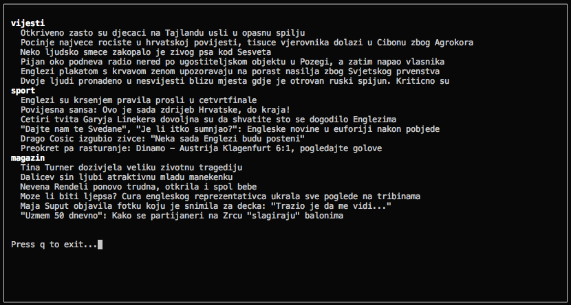

# index-hr
[](https://github.com/ellerbrock/open-source-badges/)
[](https://github.com/marinko-peso/gremlinc/blob/master/LICENSE)
[](https://pypi.org/project/indexhr/)
[](https://pypi.org/project/indexhr/)
[](http://makeapullrequest.com)

index.hr basic news content in the terminal


# Installation

Available on PyPi, latest version 0.4.
Compatible with Python 2.7.x and 3.5.x.

```sh
pip install indexhr
```


# Usage

In terminal as ```index-hr```.
Navigation using up/down arrows. Clicking enter will open the selected in the new tab of your browser.


# Example




# License

MIT.
