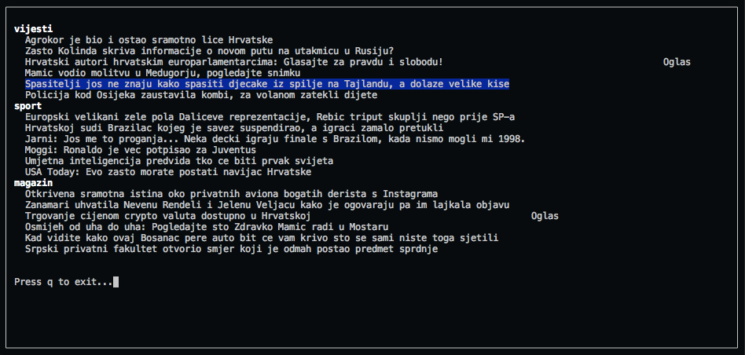

# index-hr
[](https://github.com/ellerbrock/open-source-badges/)
[](https://github.com/marinko-peso/gremlinc/blob/master/LICENSE)
[](https://pypi.org/project/indexhr/)
[](https://pypi.org/project/indexhr/)
[](http://makeapullrequest.com)
[](https://github.com/marinko-peso/index-hr/commits/master)
[](https://codecov.io/gh/marinko-peso/index-hr)

index.hr basic news content in the terminal


## Installation

Available via PyPi, compatible with Python 2.7.x and 3.6.x.

```sh
pip install indexhr
```


## Usage

In terminal as ```index-hr```.
Navigation using up/down arrows. Clicking enter will open the selected in the new tab of your browser.
Available options:
- --raw (-r) [get just the parsed data without TUI]
- ```from indexhr.scrapper import scrapped_data``` [scrapped data in your code]


## Example




## License

MIT.
